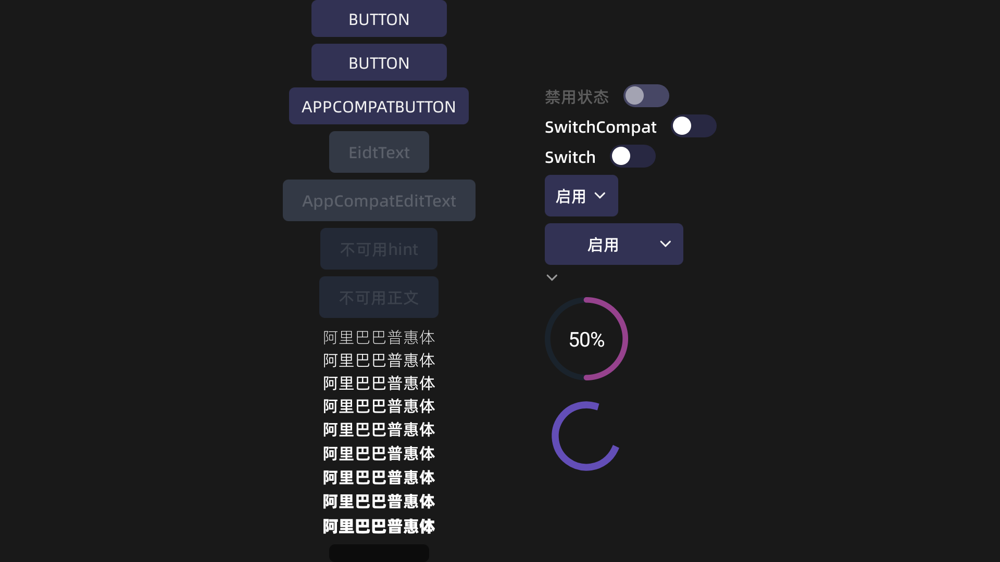

# Station OS 通用主题 123



### 主题
<文件：<b>theme.xml</b>>


**使用方法：**


**Manifest.xml->application使用主题StationTheme或继承StationTheme的主题**


```xml

<application
    ...
    android:theme="@style/Theme.PluginsCenter"
    ...
></application>

<style name="Theme.PluginsCenter" parent="StationTheme" />

```
**关于Dialog(仅支持DialogFragment)**


在DialogFragment的页面使用主题StationTheme.Dialog，这将修改按钮主题，从平面按钮修改为3D立体按钮

**字体**

字体替换为阿里巴巴普惠体，使用该字体可能会发生字体无法垂直居中的问题。目前正在定位问题

-------------

### 样式
<文件:  <b>style.xml</b>  >

控件样式列表

Station.Widget.3D.Button

Station.Widget.Button

Station.Widget.EditText

Station.Widget.Switch

Station.Widget.ImageButton

Station.Widget.Spinner

Station.Widget.SpinnerItem

Station.Widget.DropDownItem

Station.Widget.ProgressBar


