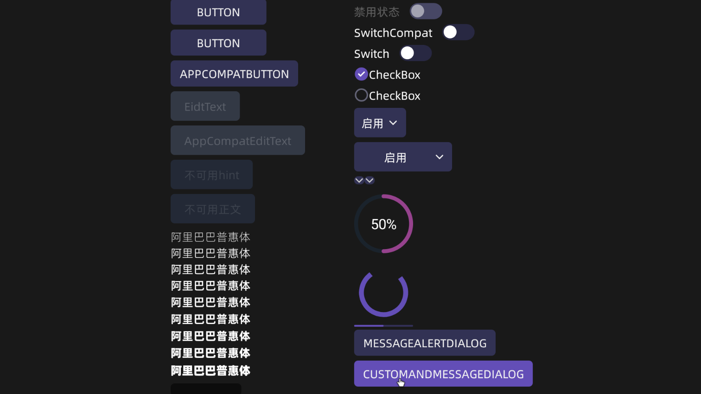
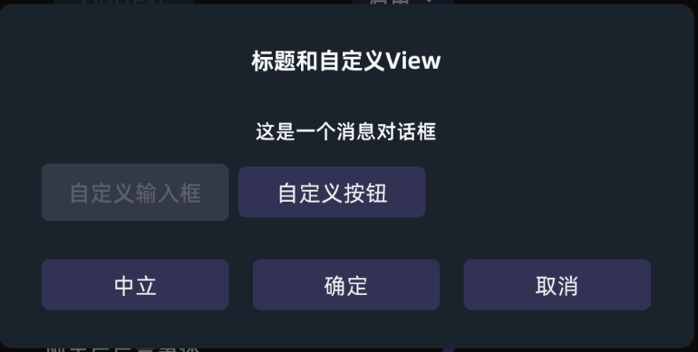

# Station OS 通用主题


### 一、主题

> 使用该主题，会改变控件的外观，参考下图



#### 使用方法：

> Manifest.xml->application使用主题StationTheme或继承StationTheme的主题


```xml
<!--AndroidManifest.xml-->

<application
    ...
    android:theme="@style/Theme.PluginsCenter"
    ...
></application>

<!--项目的theme.xml文件-->
<style name="Theme.PluginsCenter" parent="StationTheme" />


```
-------------------

<br><br><br>

### 二、弹窗主题(DialogFragment)
> StationDialogFragment 是一个 DialogFragment 类，其使用方式类似于 AlertDialog。它提供了添加确定、取消、中立按钮的支持，并且允许设置标题、信息以及自定义视图。
> 另外自定义布局的弹窗同样支持使用本主题

#### 0.设置StationOS主题
> Manifest.xml->application使用主题StationTheme或继承StationTheme的主题


```xml
<!--AndroidManifest.xml-->

<application
    ...
    android:theme="@style/Theme.PluginsCenter"
    ...
></application>

<!--项目的theme.xml文件-->
<style name="Theme.PluginsCenter" parent="StationTheme" />

```


#### 第一种情况 使用StationDialogFragment通用布局
> 效果如下图




*用法：*
```java
            StationDialogFragment dialogFragment = new StationDialogFragment.Builder(getBaseContext())
                    .setTitle("标题和自定义View")
                    .setCustomView(R.layout.station_custom_view)
                    .setMessage("这是一个消息对话框")
                    .setNegativeButton("取消", (dialog, which) -> {
                        dialog.dismiss();
                    })
                    .setPositiveButton("确定", (dialog, which) -> {
                        dialog.dismiss();
                    })
                    .setNeutralButton("中立", (dialog, which) -> {
                        dialog.dismiss();
                    })
                    .build();
            dialogFragment.show(SampleActivity.this.getSupportFragmentManager(), "dialog");
```

#### 第二种情况 使用自定义布局弹窗
> 使用DialogFragment类的onCreateView中的参数inflater加载布局即可

**例1**
```java
  @Nullable
    @Override
    public View onCreateView(@NonNull LayoutInflater inflater, @Nullable ViewGroup container, @Nullable Bundle savedInstanceState) {
        return inflater.inflate(R.layout.station_dialog, container, false);
    }
```
**例2**

```kotlin
    override fun onCreateView(
        inflater: LayoutInflater,
        container: ViewGroup?,
        savedInstanceState: Bundle?,
    ): View {
        mBinding = ViewDataBindingHelper.inflateVDB(inflater,container, this::class) as VDB
        mBinding.lifecycleOwner = this.viewLifecycleOwner
        return mBinding.root
    }
    
    
    fun inflateVDB(
        inflater: LayoutInflater,
        parent: ViewGroup?,
        kClass: KClass<*>,
    ): ViewDataBinding? {
        try {
            val clazz = getViewDataBindingClass(kClass)
            val inflate: Method? = clazz?.getDeclaredMethod("inflate",
                LayoutInflater::class.java,
                ViewGroup::class.java,
                Boolean::class.java)
            return inflate?.invoke(null,
                inflater,
                parent,
                false) as? ViewDataBinding
        } catch (e: Exception) {
            e.printStackTrace()
        }
        return null
    }
```

------------------------------


<br><br><br>

### 三、字体

字体替换为阿里巴巴普惠体，使用该字体可能会发生字体无法垂直居中的问题。目前正在定位问题

-------------


<br><br><br>

### 四、支持的样式

    * Station.Widget.3D.Button
    * Station.Widget.Button
    * Station.Widget.EditText
    * Station.Widget.Switch
    * Station.Widget.CheckBox
    * Station.Widget.ImageButton
    * Station.Widget.Spinner
    * Station.Widget.SpinnerItem
    * Station.Widget.DropDownItem
    * Station.Widget.ProgressBar
    * Station.Widget.ProgressBar.Horizontal


